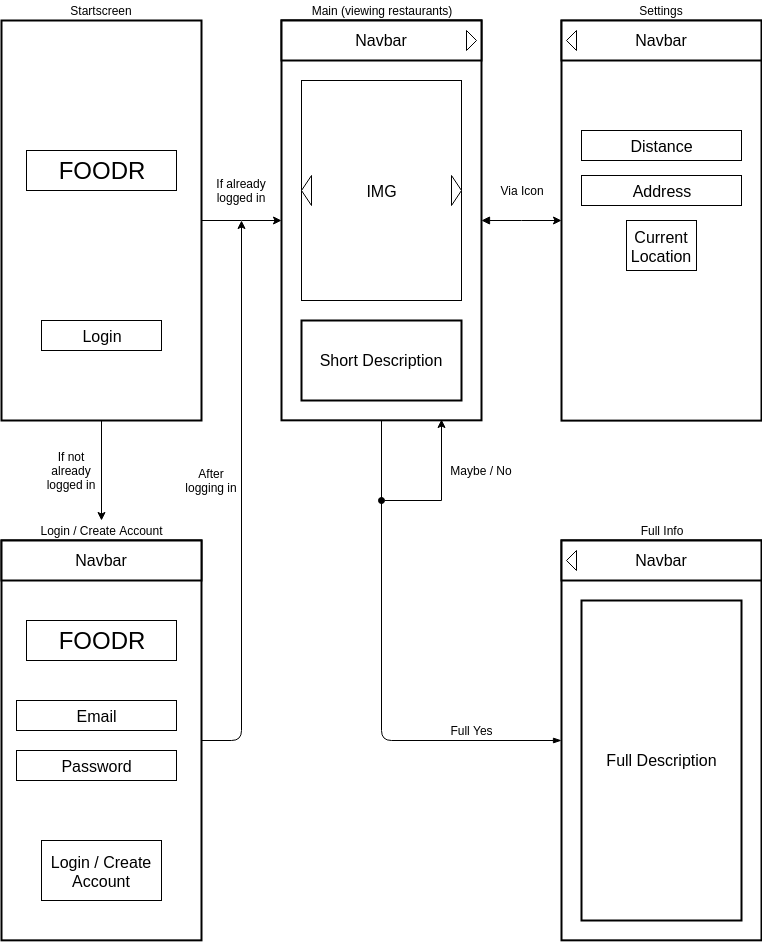
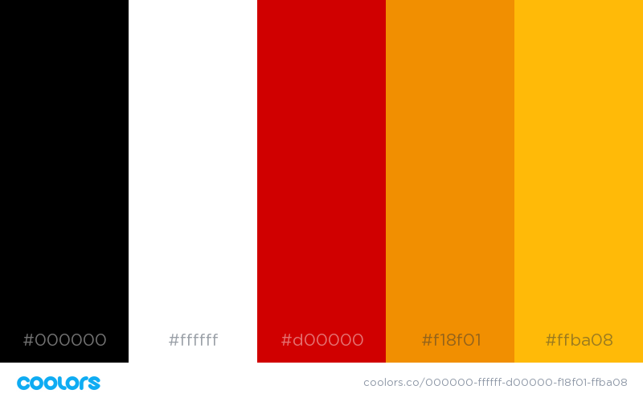
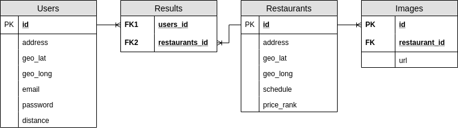

# Austin Moran - Capstone Proposal

---
## Problem Statement
This application addresses the problem of "Where do I want to eat?".  Frequently, people are hungry without knowing what they want to eat.  This app allows the user to solve this issue visually in a style reminicent of Tinder.  The user can select or reject the food images.  In doing so they can narrow down their options and find a place to eat.

---
## Technologies Used

### Application
* Progressive Web Application (Service Workers + App Manifest)
* Phonegap for App Store

### Frontend
* Vue (if possible)

### Backend
* Express.js
* Knex.js

### Database
* Google Places API (https://developers.google.com/places/web-service/intro)
* Foursquare Places API (https://developer.foursquare.com/places-api)
* PostgreSQL

---
## Wireframe


---
## Palette


---
## ERD


---
## Server Route Plan
```
GET
  ('/')
    - Return array of restaurant objects based on user object/token sent to server.

POST
  ('/')
    - Create a new user, create and save initial search data based on their location.

PATCH
  ('/')
    - Update user preferences
    - Create new search data

DELETE
  ('/')
    - Delete user profile (uninstall equivalent)
```

---
## Planning Tool & User Stories
[User Stories on Trello](https://trello.com/b/rZkHOTdH/capstone-am)
---
